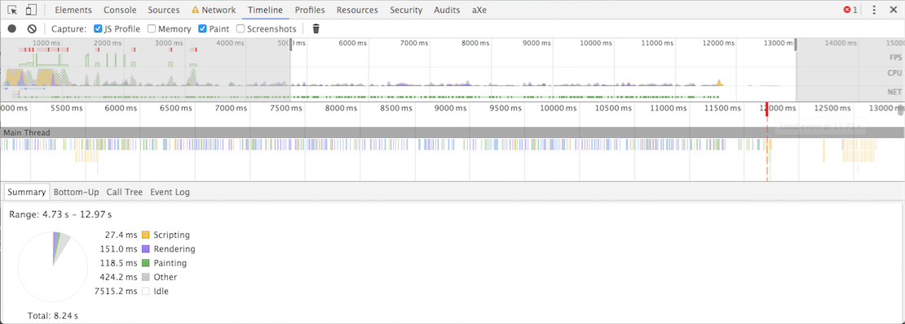

# Application
Live demo: https://fons.alleenmedia.nl

# Week 1

### Header image resize

#### Before

### After

#### Summary

The header image took **2.3 minutes** to load first and after compression it took **8.9 seconds** on a 2g internet connection.
This is a difference of more than 2 minutes and a huge performance boost for your website.

## jQuery include

#### Before

#### After

#### Summary

With jQuery the page loads within **12.46** seconds and without jQuery the page loads in **11.42** seconds on a 4g internet connection. jQuery is a serious plugin which costs a lot of loading time. My advice would be: rethink your application if you really need jQuery for your application. Otherwise just try and use vanilla Javascript.

### Icon spritesheet

#### Before

#### After

#### Summary

With an icon spritesheet the page loads within **12.60** seconds and without a spritesheet the page loads in **12.62** seconds on a 4g internet connection. As you can see this not a big win for performance, but it helps a couple of milliseconds.

### Conclusion

Before adding changes to this project, the loading time of the application was 5.32 seconds (tested in Google Chrome).
Because of a "bug" in my browser, the browser doesn't show the first loading time accurate. I was testing this by turning jQuery on and off and by doing this sometimes the first load event takes 1.43 ms and sometimes it takes 12+ seconds. This is why I haven't shown screenshots of my Timeline panel in Chrome.

Tests with results in short:
- Header image resize: from **2.3 minutes** to **8.9 seconds** loading time at 2g connection
- jQuery includes: from **12.46 seconds** to **11.42 seconds** loading time at 4g connection
- Icon spritesheet: from **12.62 seconds** tot **12.60 seconds** loading time at 4g connection
- Changing HTML structure: this didn't had many impact on loading speed. Only a couple of milliseconds (1-3).
- Changing CSS specific selectors: this didn't had many impact on loading speed. Only a couple of milliseconds (1-3).
- Changing to a Single Page Webapp: because of extra libraries this cost extra loading time and made the application slower.

# Week 2

## Progressive Web Apps

### What is a Progressive Web App?

A Progressive Web App provides an app-like user experience that is low friction and is built using modern web capabilities and hosted on the web and can become an app on the user's system over time.

A progressive web app is built with Progressive Enhancement as the core tenant so that they work for as many users as possible irrespective of browser choice. When the User-Agent (such as Chrome, Opera and Firefox) supports technologies like Service Worker, Web Push, and the Add to Homescreen banner, the apps can be enhanced to provide a first class native-like experience for the user.

#### Progressive web apps are:

- **Progressive** - They work for every user, regardless of the browser.
- **Responsive** - They fit on every screen.
- **Connectivity independent** - Enhanced with service workers to work offline and with low quality network connections.
- **App-like** - Feel like a native application.
- **Fresh**	- They are always up-to-date, thanks to the service worker.
- **Safe** - Served via HTTPS.
- **Discoverable** - Are identifiable as "applications", allowing search engines to find them.
- **Re-engageable** - Make re-engagement easy through features like push notifications.
- **Installable** - Allow users to keep apps on the home screen, without needing an app store.
- **Linkable** - Easily shareable via URL.

#### Progressive must-haves

At a high level, for a web app to be considered “progressive” it must do three things:

- Register a service worker — a series of APIs championed by Google that allows for offline access, web push notifications, and more.
- Run on HTTPS, which is a hard requirement imposed by the service workers spec to prevent man-in-the-middle attacks.
- Create an app manifest file, which specifies a bunch of information about your app such as its name.

#### Sources:

- https://developers.google.com/web/progressive-web-apps
- https://addyosmani.com/blog/getting-started-with-progressive-web-apps/

## Serviceworker performance edits

With my integration of the serviceworker I've cached javascript libraries, stylesheets and images. Doing this increasingly speeded up my your first load event as you can see in my results with no throttling.

### Before adding my serviceworker caching files

Load event: **1440 milliseconds**

### After adding my serviceworker caching files

Load event: **262 milliseconds**

Offline is even faster. As you can see here:

Load event: **249 milliseconds**

Here you can see files are served from the serviceworker:

### Conclusion
Using a serviceworker drastically increased the performance of my application. These performance edits are even more essential for 3g networks on mobile devices where it takes a bit more time to load content.

# Week 3

## Task managers

Delays in performance have the potential to impact user engagement, experience and revenue. Thankfully Google is there for us to recommend a set of best-practice rules for keeping your pages lean, fast and smooth. These include minifying resources like CSS and JavaScript, optimizing images, inlining and removing unused styles and so on. For now there are 2 popular task managers that developers/companies use for projects.

### Grunt vs Gulp

#### Grunt

Grunt is a pioneer in the JavaScript automation workflow area. There are a lot of known Grunt users like Twitter, jQuery and Modernizr.

The basic principle for Grunt is to give us an easy way to run tasks. A task is a set of code files and configuration files already created for you. You can get new tasks by installing Grunt plugins that you will get using npm. You can find a plugin for pretty much every tool you might use, such as Less and JSHint.

#### Gulp

Gulp is an alternative to grunt. It is a bit more recent and has a reputation as being more flexible than grunt.

Gulp (http://gulpjs.com/) is a workflow automation tool. Like grunt, it works using npm and the package.json file. All available plugins will also be downloaded using npm and added as devDependencies in the package.json file.

#### Difference

One of the main differences with Gulp is that it uses streams. A stream is a set of functions through which a file will go and be modified in memory. The file will be written on the disk only at the end of the process so it is more efficient. Grunt tasks, on the other hand, work as silos and cannot be chained.

**Process**

Assume you would like to write SASS code for your project. You would want to compile your SASS code and then perhaps minify it.

Grunt handles this using intermediary files which are disk I/O operations. Your SASS file is compiled and then written to a temporary file. The temporary file is used by the autoprefixer and then the final product is written to the destination file.

Gulp takes care of all this in-memory. Your source SASS file is compiled, the result is passed to the autoprefixer without being written to a file and the destination file is then written out.

Compared to in-memory operations, disk writes are slow which means that Gulp has a big speed advantage (for now). A speed comparison was done by tech.tmw which shows that most tasks are at least twice as fast on Gulp.

#### Conclusion

I don’t think there’s any question about the fact that both Grunt and Gulp are great tools and have helped people save countless hours of time over the years. Grunt is a bit slower for now, but has a much bigger community. Gulp is faster, has a cleaner API, but is lacking the user base.

I think that the decision will ultimately come down to continuity, available plugins and preference.

- (1) If you’ve been using Grunt/Gulp for a while now and you’re happy with it, there’s no reason to switch.

- (2) If your project requires plugins which are not provided by Gulp and you’re not prepared to write one yourself, you will need to go with Grunt.

- (3) If the above two considerations do not apply to you it will come down to preference. I suggest trying out both and seeing which one sticks with you.

I chose to use Gulp because I like its cleaner API better. While there are differences between both, there is no clear winner and both projects can, and will, coexist.

#### Sources:
- http://www.sitepoint.com/how-to-grunt-and-gulp-your-way-to-workflow-automation/
- http://yeoman.io/blog/performance-optimization.html
- http://www.hongkiat.com/blog/gulp-vs-grunt/

### Optmising HTTP-requests

Reducing HTTP-requests increases the performance of your application. Therefore I've added some automation tasks with Gulp to help speed up my edit of the LookLive application.

#### Before

First load event: **11.81s**

#### After

First load event: **11.71s**

#### Conclusion

Difference between load events before and after concatenating files is **100 milliseconds**.

### Optimising web fonts

When trying to optimise web fonts, I found out that the inital page load is slower than before when applying a font face observer. This will monitor when a web font is applied to the page and notifies you. It does not limit you in any way in where, when, or how you load your web fonts. In my case this change enhanced the perceived performance, but not the page load performance of the webapp. So the application shows the fonts at the very first paint of the application, but it's slower in the end.

#### Before

First load event: **11.89s**

#### After

First load event: **11.98s**

#### Conclusion
The difference between the initial page load is 10 milliseconds after optimising. But you can see that the rendering and the painting is faster than before this change.

### Optimising images

For compressing images I've used the image-min gulp package. This drastically boosts your overall performance because it uses advanced techniques and is bundled with lossless optimizers. See [gulp-imagemin](https://www.npmjs.com/package/gulp-imagemin). For this project I've saved the header image as JPG file which is how it should be, but to really demonstrate the performance I've compressed the big header.png image and tested this with a 4g connection.

#### Before

- header.png size: **2mb**
- logo.png size: **15kb**
- First load event: **15.71s**

#### After 

- header.png size: **1.1mb**
- logo.png size: **6kb**
- First load event: **13.58s**

#### Conclusion

Difference between load events is **2.13** seconds and the gulp-imagemin plugin compressed the header with **900 kb's**.
This is a big win for your application.
